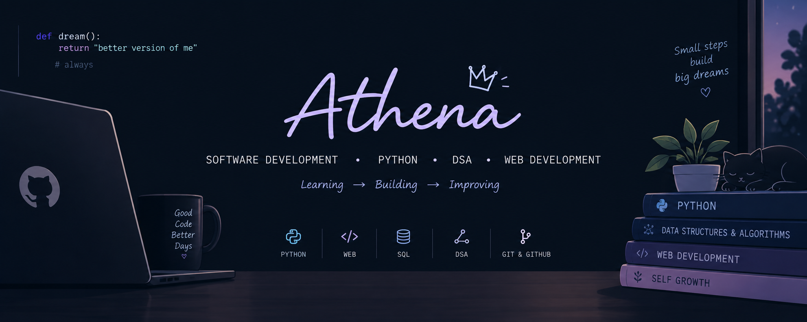

<div align="center">



### College Student • Aspiring Software Developer

**Learning → Building → Improving**

</div>

---

## 👋 About Me

Hi, I'm **Athena**.

I'm a college student exploring software development and building my skills one project at a time.

I enjoy learning by actually building things, experimenting with code, and turning what I learn into projects.

---

## 🚀 What I'm Currently Doing

* 🐍 Strengthening my **Python** fundamentals
* 🧠 Learning **Data Structures & Algorithms**
* 🌐 Exploring **Web Development**
* 🗄️ Improving my **SQL** and database knowledge
* 💻 Building projects to apply what I learn
* 📚 Preparing for **Java & Full Stack Development**

---

## 🛠️ Tech Stack

### Languages


### Web Development


### Databases & Tools


---

## 📌 Featured Project

### 🎮 Snake Water Gun

A simple Python game that I turned into a complete GitHub project, with a browser-based version built using **HTML, CSS and JavaScript**.

**What I practiced:**

* Python programming
* Game logic
* Randomization
* JavaScript fundamentals
* DOM interaction
* HTML & CSS
* Git & GitHub

> One of my first projects — built while learning and experimenting.

---

## 🎯 My Learning Journey

```text
Python
  ↓
Programming Fundamentals
  ↓
DSA + Problem Solving
  ↓
Web Development
  ↓
Java
  ↓
Full Stack Development
  ↓
Build Better Projects
```

I'm focusing on understanding the fundamentals rather than just collecting technologies.

---

## 📊 GitHub

<div align="center">

### Learning something new. Building something better.


</div>

---

## 🌐 Connect With Me

**LinkedIn:** Athena Ajeesh
**Email:** [athenaajeesh.bs24@bmsce.ac.in](mailto:athenaajeesh.bs24@bmsce.ac.in)

---

<div align="center">

### ✨ Learning by building, one project at a time.

</div>
